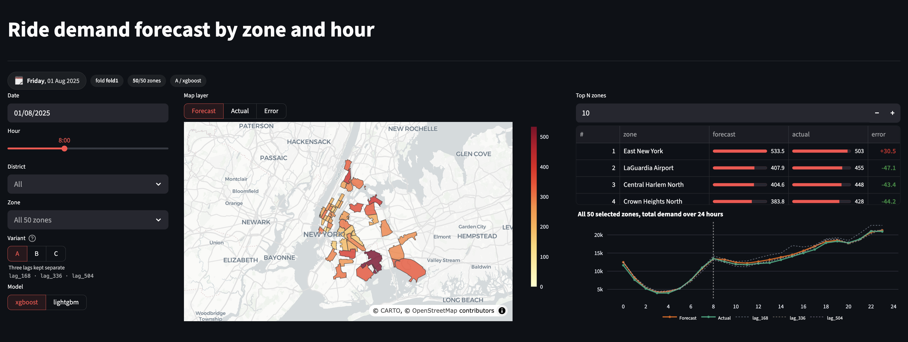

# SHAP Stability under Correlated Time-Series Features

## Tổng quan

Đây là một dự án nghiên cứu về độ ổn định của SHAP khi mô hình dự báo nhu cầu gọi xe theo giờ
ở NYC sử dụng các weekly lag có tương quan. Mục tiêu là kiểm tra cách biểu diễn weekly lag ảnh
hưởng đến kết quả dự báo và cách mô hình phân bổ attribution; dự án không nhằm xây dựng một hệ thống
dự báo vận hành thực tế.

Dự án trả lời ba câu hỏi:

1. `lag_168`, `lag_336` và `lag_504` tương quan với nhau như thế nào giữa 50 zone đã freeze?
2. SHAP importance của các feature này thay đổi ra sao qua các fold theo thời gian?
3. Việc gộp weekly lag trong Variant B/C ảnh hưởng thế nào đến kết quả dự báo và importance của weekly group
   so với Variant A, và xu hướng có nhất quán giữa LightGBM và XGBoost không?

## Khái niệm chính

| Khái niệm | Giải thích ngắn |
|---|---|
| `demand` | Số request HVFHV trong một pickup zone ở một target hour; đây là biến cần dự báo. |
| `pu_location_id` + `target_datetime` | Zone ID và target hour, kết hợp thành row key duy nhất của một dòng modeling. |
| Calendar features | `hour`, `dayofweek` và `is_holiday` mô tả bối cảnh thời gian của target hour. |
| Weekly lag features | Demand của cùng zone ở các giờ trước; `lag_168`, `lag_336`, `lag_504` lần lượt là 1, 2, 3 tuần trước. |
| `median_lag_3w` | Median của ba weekly lag, dùng làm một đại diện gộp cho nhóm feature tương quan. |
| Variant A/B/C | Ba cách biểu diễn riêng nhóm weekly lag; các feature và dữ liệu còn lại không đổi. |
| Temporal fold / `final_test` | Train trên lịch sử rồi đánh giá tháng kế tiếp; tháng 12 được giữ riêng làm final test. |
| HPO và frozen config | Tune Variant A bằng 20 Optuna trials mỗi model, sau đó dùng lại best config cho mọi variant và fold. |
| SHAP importance | Mean absolute SHAP cho biết mức đóng góp trung bình của một feature; weekly-group importance là tổng của nhóm weekly feature. |
| MAE / RMSE / WAPE | MAE là sai số tuyệt đối trung bình; RMSE phạt sai số lớn mạnh hơn; WAPE biểu diễn tổng sai số tuyệt đối theo phần trăm tổng demand thực tế. |
| Artifact | File model, prediction, metric, config hoặc SHAP được lưu để audit và reproduction. |

## Thiết kế thí nghiệm

| Hạng mục | Thiết lập |
|---|---|
| Dữ liệu | NYC TLC HVFHV, 12 tháng năm 2025; aggregate theo pickup zone × hour |
| Phạm vi zone | Top-50 zone được freeze theo tổng demand trong Jan-Jun |
| Feature chính | `hour`, `dayofweek`, `is_holiday`, `lag_1`, `lag_24` và weekly lag |
| Các variant | A: ba lag riêng; B: `median_lag_3w`; C: `lag_168` + `median_lag_3w` |
| Mô hình và tuning | LightGBM/XGBoost; chỉ tune Variant A bằng 20 Optuna trials mỗi model |
| Đánh giá | HPO tháng 07; Fold 1-4 đánh giá tháng 08-11; `final_test` là tháng 12 |
| Chỉ số và SHAP | MAE, RMSE, WAPE (%); `TreeExplainer`, `tree_path_dependent`, 5.000 dòng mẫu mỗi fold |

Mỗi row dùng cho model có key `(pu_location_id, target_datetime)`. Các lag chỉ dùng demand trước
target hour. Variant A được tune bằng 20 Optuna trials cho mỗi model; cấu hình tốt nhất được
freeze và dùng lại cho mọi variant, fold và `final_test`.

## Kết quả chính

Các bảng đầy đủ, số liệu theo từng fold và diễn giải kết quả nằm trong
[báo cáo kỹ thuật](results/stats/summary.md).

- Ba cặp weekly lag có mean Pearson khoảng **0.894-0.908** trên 50 zone.
- Variant B/C giảm mean MAE khoảng **0.4-1.1%** so với A ở cả hai mô hình, nhưng chênh lệch nhỏ hơn
  biến thiên giữa các tháng nên chưa đủ để kết luận B/C tốt hơn.
- Trong Variant C, attribution của `lag_168` giảm rõ rệt khi đứng cạnh `median_lag_3w`; credit
  chuyển phần lớn sang feature gộp ở cả hai mô hình.
- Kết quả hiện có chưa cho thấy một variant ổn định hơn một cách rõ ràng ở mức feature hoặc
  weekly group.

## Demo tương tác

Dashboard Streamlit đọc lại artifact hiện có để trình bày kết quả, không train lại model. Trang **Forecast**
cho phép xem demand theo zone và hour; trang **Experiment** trình bày correlation, prediction metrics và
SHAP importance theo các bảng trong báo cáo kỹ thuật.



Chạy dashboard từ project root:

```bash
conda activate shap-stability-ride-demand
python -m src.dashboard.build_zone_geojson
streamlit run dashboard_app.py
```

Hướng dẫn chi tiết nằm trong [Dashboard README](src/dashboard/README.md).

## Tái lập thí nghiệm

Chạy các lệnh sau từ thư mục gốc. Chọn một trong hai lệnh đầu tiên để tạo mới hoặc cập nhật
môi trường:

```bash
# Tạo môi trường mới.
conda env create -f environment.yaml

# Hoặc cập nhật môi trường đã có.
conda env update -f environment.yaml

conda activate shap-stability-ride-demand

# Tải raw data nếu data/raw/ chưa có đủ 12 file Parquet.
python -m src.data.download_raw

# Dựng và kiểm tra bàn giao dữ liệu.
python -m src.data.freeze_zones
python -m src.data.build_panel
python -m src.data.correlation_analysis
python -m src.data.split_folds
python -m src.data.qa_checks

# Chạy HPO, so sánh baseline, 30 lần chạy core, SHAP và QA artifact.
python run.py all

# Tạo bảng và hình tổng hợp.
python -m src.analysis.run_stats

# Chạy test hợp đồng của Pipeline.
python -m unittest src.test.test_pipeline
```

Tải raw data là bước tùy chọn nếu 12 file nguồn đã tồn tại. Pipeline không ghi đè artifact của lần chạy
đã có; khi cần chạy mới, hãy dùng output sạch hoặc xóa đúng các artifact đã được phê duyệt.

## Kho mã và tài liệu

| Đường dẫn | Nội dung và tài liệu |
|---|---|
| `configs/` | Cấu hình data, feature, variant, model, HPO và SHAP |
| `src/data/` | Ingestion, aggregate, panel, feature, correlation, fold và [Data QA](src/data/README.md) |
| `src/pipeline/` | HPO, huấn luyện, dự báo, SHAP, artifact và [QA ma trận](src/pipeline/README.md) |
| `src/analysis/` | Bảng, hình và [báo cáo kỹ thuật](src/analysis/README.md) |
| `src/dashboard/` | Dashboard đọc lại dự báo và bảng kết quả ([hướng dẫn](src/dashboard/README.md)) |
| `src/heatmap/` | Dữ liệu địa lý tĩnh ([hướng dẫn](src/heatmap/README.md)) |
| `data/processed/`, `data/folds/`, `results/` | Bàn giao dữ liệu, input của split theo thời gian và artifact; xem [từ điển dữ liệu](data/processed/data_dictionary.md) và [tóm tắt kết quả](results/stats/summary.md) |

## Đóng góp theo vai trò

| Vai trò | Nhiệm vụ chính |
|---|---|
| Tech Lead | Giữ câu hỏi nghiên cứu và protocol nhất quán; điều phối bàn giao; review ma trận, artifact và kết luận cuối. |
| AI Data | Xử lý raw data; freeze top-50 zone; dựng panel/feature; kiểm tra leakage và correlation. |
| AI Pipeline | Xây dựng config, split theo thời gian, runner, shared metrics, SHAP sampling, artifact layout và QA. |
| AI Model | Chạy baseline/HPO; freeze config của model; chạy A/B/C trên fold và `final_test`; tạo kết quả dự báo/SHAP. |
| QA/QC | Audit target, lag, split, config, metrics, SHAP keys, tái lập và tính nhất quán của báo cáo. |
