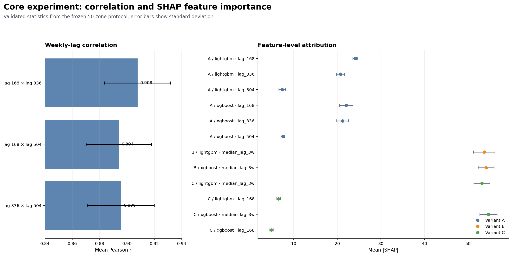
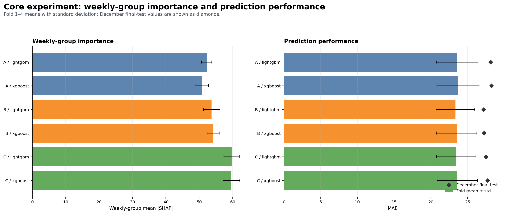

# SHAP Stability under Correlated Time-Series Features

## Tổng quan

Project nghiên cứu độ ổn định của SHAP khi mô hình dự báo nhu cầu gọi xe theo giờ ở NYC dùng các
weekly lag có tương quan. Mục tiêu là so sánh cách biểu diễn weekly lag ảnh hưởng đến prediction và
feature attribution; đây không phải hệ thống dự báo vận hành.

Project sử dụng 12 raw Parquet files của NYC TLC HVFHV năm 2025. Bước download trong phần reproduction
sẽ tải các file này vào `data/raw/`.

## Khái niệm chính

| Khái niệm | Giải thích |
|---|---|
| `demand` | Số request tại một pickup zone trong một target hour; đây là target cần dự báo. |
| Row key | `(pu_location_id, target_datetime)` xác định duy nhất một modeling row. |
| Weekly lags | `lag_168`, `lag_336`, `lag_504` là demand của cùng zone ở 1, 2, 3 tuần trước. |
| Variant A/B/C | A giữ ba lag riêng; B dùng `median_lag_3w`; C dùng `lag_168` và `median_lag_3w`. |
| Temporal folds | HPO dùng tháng 07; Fold 1-4 đánh giá tháng 08-11; `final_test` là tháng 12. |
| SHAP importance | Mean absolute SHAP trên 5.000 sample rows; weekly-group importance là tổng của weekly features. |

## Thiết kế thí nghiệm

| Hạng mục | Thiết lập |
|---|---|
| Dữ liệu | NYC TLC HVFHV 2025, aggregate theo pickup zone × hour |
| Zones | Top-50 zone, freeze theo tổng demand trong Jan-Jun |
| Models | LightGBM và XGBoost |
| HPO | Chỉ tune Variant A, 20 Optuna trials/model, seed 42 |
| Metrics | MAE, RMSE, WAPE (%) |
| SHAP | `TreeExplainer`, `tree_path_dependent`, 100 rows/zone/fold |

## Kết quả chính

Kết quả dưới đây lấy từ core experiment đã validate; báo cáo kỹ thuật chứa bảng số liệu đầy đủ.

- **Tương quan:** ba weekly lags có mean Pearson `r` khoảng **0.89–0.91** trên 50 zones.
- **Dự báo:** A/B/C cho forecasting performance gần nhau; spread mean MAE chỉ khoảng **0.350**, nhỏ hơn nhiều so với fold-to-fold standard deviation tối đa **2.867**.
- **Giải thích:** feature-level SHAP credit thay đổi rõ hơn prediction; ở Variant C, credit chuyển mạnh sang `median_lag_3w` và phần của `lag_168` giảm rõ.
- **Nhóm weekly:** aggregation không làm weekly-group SHAP variability giảm nhất quán; group sizes khác nhau giữa A/B/C nên không xếp hạng stability trực tiếp bằng bảng này.



*Tương quan vẫn cao trong khi SHAP credit chuyển giữa các lag feature.*



*Prediction gần nhau giữa các variants, còn weekly-group variability không giảm nhất quán.*

> **Kết luận chính:** Độ bền vững của dự báo không đồng nghĩa với tính bất biến của giải thích (predictive robustness ≠ explanation invariance).

## QA Review

Core experiment đã được review độc lập trên toàn bộ 30 runs:

- **Prediction metrics:** 30/30 recalculations **PASS**.
- **SHAP importance:** 30/30 recalculations **PASS**; SHAP sampling dùng **5,000 rows/run**, với feature counts A = 58, B = 56 và C = 57.
- Không phát hiện inconsistency nào làm thay đổi các kết luận chính.

Xem [báo cáo QA Review](docs/qa_review_summary.md) để biết phạm vi và bằng chứng kiểm tra.

## Tái lập toàn bộ experiment

Chạy từ project root:

```bash
# Tạo Conda environment.
conda env create -f environment.yaml

# Kích hoạt environment của project.
conda activate shap-stability-ride-demand

# Tải 12 raw NYC TLC HVFHV Parquet files năm 2025.
python -m src.data.download_raw

# Tổng hợp 12 tháng và freeze Top-50 zones từ Jan-Jun.
python -m src.data.freeze_zones

# Xây dense hourly panel và calendar/lag features.
python -m src.data.build_panel

# Tính correlation giữa các weekly lags trên 50 zones.
python -m src.data.correlation_analysis

# Tạo HPO, Fold 1-4 và final-test temporal splits.
python -m src.data.split_folds

# Kiểm tra schema, features, lag alignment, splits và leakage.
python -m src.data.qa_checks

# Chạy HPO, baseline/tuned comparison, 30 core runs, SHAP và Pipeline QA.
python run.py all

# Tạo summary tables, plots và technical report.
python -m src.analysis.run_stats

# Chạy Pipeline contract tests.
python -m unittest src.test.test_pipeline
```

Các output chính nằm ở `data/processed/`, `data/folds/` và `results/`.

> **Lưu ý về reproducibility:** Do khác biệt về phần cứng, hệ điều hành và phiên bản thư viện, kết quả chạy lại có thể có chênh lệch số nhỏ trong phạm vi chấp nhận được; xu hướng và kết luận chính được kỳ vọng nhất quán.

## Dashboard

Chạy sau khi toàn bộ experiment và analysis đã hoàn tất:

```bash
# Tạo GeoJSON cho 50 frozen zones.
python -m src.dashboard.build_zone_geojson

# Khởi chạy interactive Dashboard.
streamlit run dashboard_app.py
```

Trang **Forecast** hiển thị forecast/actual/error theo zone và hour. Trang **Experiment** hiển thị
correlation, prediction metrics, SHAP importance và weekly-group importance. Xem thêm
[Dashboard README](src/dashboard/README.md).


*Forecast page: inspect demand, prediction and error by zone and hour.*

## Tài liệu chi tiết

- [Báo cáo kỹ thuật](results/stats/summary.md): số liệu và kết luận chính.
- [Data README](src/data/README.md): raw data, feature table, folds và Data QA.
- [Pipeline README](src/pipeline/README.md): HPO, training, prediction, SHAP và Pipeline QA.
- [Analysis README](src/analysis/README.md): aggregation và report generation.
- [Heatmap README](src/heatmap/README.md): nguồn geometry cho dashboard.

## Đóng góp theo vai trò

| Vai trò | Nhiệm vụ |
|---|---|
| Tech Lead | Giữ research question/protocol, điều phối handoff và review kết luận. |
| AI Data | Xử lý raw data, freeze zones, dựng panel/features và kiểm tra leakage/correlation. |
| AI Pipeline | Xây runner, temporal splits, metrics, SHAP sampling, artifact layout và QA. |
| AI Model | Chạy baseline/HPO, freeze model config và tạo prediction/SHAP cho A/B/C. |
| QA/QC | Audit target, lags, splits, config, metrics, SHAP keys và reproduction evidence. |
