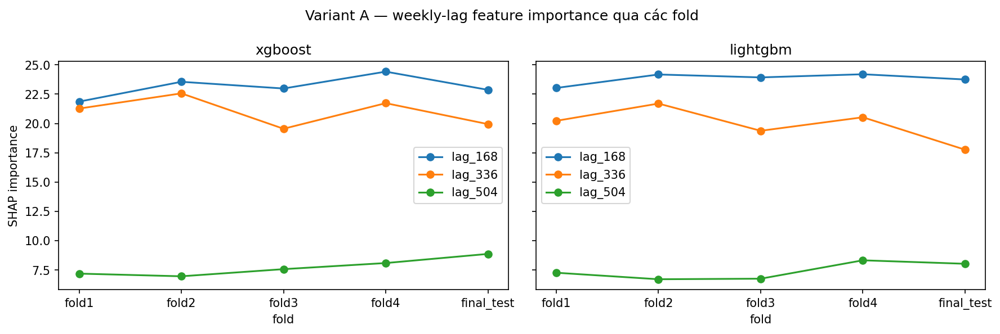
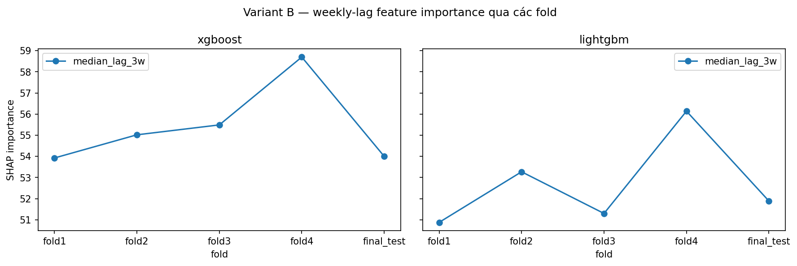
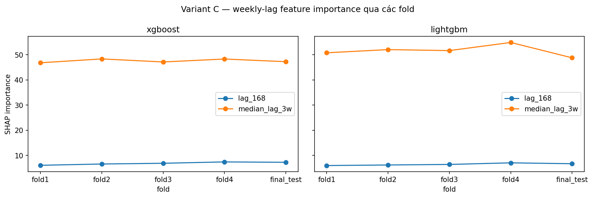
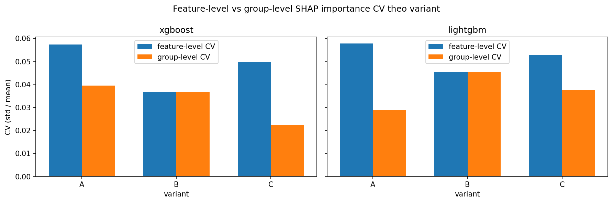

# shap-stability-ride-demand
AIO Conquer Module 03 Project: SHAP Stability under Correlated Time-Series Features for Hourly Zone-Level Ride-Demand Forecasting

Câu hỏi nghiên cứu chính (`m03-proposal.pdf` mục 1): 3 weekly lag (`lag_168`, `lag_336`, `lag_504`)
của demand theo giờ NYC tương quan ra sao; SHAP importance của chúng ổn định thế nào qua các fold
theo thời gian; và việc gộp các feature này (Variant B/C) ảnh hưởng thế nào đến explanation
stability và forecasting performance so với giữ riêng lẻ (Variant A)?

## Đánh giá kết quả nghiên cứu

Trả lời theo 3 tiêu chí hoàn thành ở `m03-proposal.pdf` mục 6, dựa trên artifact thực đã chạy
(pipeline: [src/pipeline/readme.md](src/pipeline/readme.md), tổng hợp:
[src/analysis/readme.md](src/analysis/readme.md), số liệu đầy đủ:
[results/stats/summary.md](results/stats/summary.md)).

> **Quy ước báo cáo:** proposal mục 2.6 ghi rõ *"Không dùng coefficient of variation hoặc
> significance test trong core scope"*, kèm cảnh báo không kết luận feature nào "ổn định hơn" chỉ dựa
> vào std khi mean importance chênh lệch lớn. Vì vậy số liệu chính là **mean ± std**; CV chỉ là
> diagnostic ngoài spec.

### 1. Tương quan giữa 3 weekly lag — xác nhận premise

`data/processed/correlation_summary.csv` (Pearson theo từng zone trong 50 zone, 22/01–31/07/2025):
mean r = **0.89–0.91** cho cả 3 cặp (`lag_168×lag_336`=0.908, `lag_168×lag_504`=0.894,
`lag_336×lag_504`=0.896), std r chỉ **0.024** trên 50 zone. Tương quan **cao và đồng nhất giữa các
zone** — premise của đề tài đứng vững.

### 2. Mean ± std của SHAP importance qua fold1-4 (số liệu chính theo proposal mục 2.6)

| variant | model | feature | mean ± std | final_test |
|---|---|---|---|---|
| A | lightgbm | `lag_168` | 23.83 ± 0.55 | 23.75 |
| A | lightgbm | `lag_336` | 20.46 ± 0.96 | 17.77 |
| A | lightgbm | `lag_504` | 7.27 ± 0.75 | 8.04 |
| A | xgboost | `lag_168` | 23.21 ± 1.07 | 22.87 |
| A | xgboost | `lag_336` | 21.28 ± 1.27 | 19.95 |
| A | xgboost | `lag_504` | 7.46 ± 0.49 | 8.88 |
| B | lightgbm | `median_lag_3w` | 52.90 ± 2.40 | 51.89 |
| B | xgboost | `median_lag_3w` | 55.78 ± 2.05 | 54.00 |
| C | lightgbm | `lag_168` | 6.44 ± 0.46 | 6.73 |
| C | lightgbm | `median_lag_3w` | 52.36 ± 1.77 | 48.80 |
| C | xgboost | `lag_168` | 6.77 ± 0.56 | 7.29 |
| C | xgboost | `median_lag_3w` | 47.67 ± 0.79 | 47.26 |

**Đọc std cùng với mean, không tách rời:** các feature ở đây chênh nhau nhiều lần về mean (vd.
`lag_504` ≈ 7 so với `lag_168` ≈ 23), nên so std trực tiếp giữa chúng để xếp hạng "ổn định" là sai —
đúng cảnh báo proposal mục 2.6. `final_test` (tháng 12) báo cáo riêng, không gộp vào mean/std.

Xu hướng qua từng fold:

| Variant A | Variant B | Variant C |
|---|---|---|
|  |  |  |

### 2b. Tháng 12 có làm attribution dịch chuyển không? — phần lớn là **không**

`results/stats/final_test_shift.csv` và `results/stats/trend_confound_check.csv`.

Thoạt nhìn có vẻ có: 3/12 dòng lệch quá 2σ so với phân bố fold1-4, `lag_336` giảm và `lag_504` tăng.
Nhưng **`final_test` vừa là tháng lệch regime, vừa là fold có train set lớn nhất** (229k → 266k →
302k → 340k → **376k** row, mỗi fold thêm đúng ~1 tháng), nên hai cách giải thích bị lẫn. Cách tách:
nếu do train-size/drift thì xu hướng phải **đã có sẵn** và đơn điệu qua fold1-4, `final_test` chỉ nối
dài; nếu do regime thì fold1-4 phẳng còn `final_test` **gãy ra khỏi dải** fold1-4.

Kết quả sau khi tách:

| verdict | số dòng |
|---|---|
| `final_test` nằm **trong dải** fold1-4 — không phải dịch chuyển thật | **9/12** |
| Gãy khỏi dải, fold1-4 không có xu hướng → regime là cách đọc hợp lý hơn | **2/12** |
| Gãy khỏi dải nhưng chỉ **nối dài** xu hướng sẵn có → lẫn confound train-size | 1/12 |

Hai dòng trụ được đều là `lag_336` (A/lightgbm, ρ=0.00 qua fold1-4 rồi rơi xuống dưới toàn bộ dải) và
`median_lag_3w` (C/lightgbm). Dòng `lag_504` z=+2.87 — con số ấn tượng nhất ban đầu — **không trụ
được**: nó đã tăng dần sẵn qua fold1-4 (ρ=+0.80) khi train set lớn dần, `final_test` chỉ nối tiếp.

**Vì vậy claim ban đầu "credit dịch từ lag 2 tuần sang lag 3 tuần" đã bị rút lại.** Nửa "sang lag 3
tuần" lẫn confound train-size; nửa "rời lag 2 tuần" chỉ trụ ở **1 trong 2 model** (lightgbm gãy,
xgboost vẫn trong dải), nên cũng không có tính nhất quán giữa model như tôi từng viết.

Những gì còn lại, phát biểu ở đúng độ mạnh: **2/12 dòng cho thấy tháng 12 làm gãy quỹ đạo importance,
cả hai đều ở lightgbm.** Đó là tín hiệu yếu, gợi ý chứ chưa chứng minh rằng regime khác sẽ làm
attribution dịch — và nó đủ để nói bốn fold liền kề (các tháng đồng dạng, train tăng đều) chưa bao
giờ thực sự thử thách tính ổn định mà đề tài muốn đo.

> **Lưu ý xuyên suốt về ngôn ngữ σ:** mọi std trong báo cáo này đều ước lượng từ **n=4**. Một con số
> như "2.8σ" vì thế rất nhiễu — chính bảng trên cho thấy có dòng z vượt 2 mà giá trị vẫn nằm trong
> dải quan sát của fold1-4. Nên đọc σ ở đây như chỉ báo thô, không phải thước đo chắc chắn.

### 3. Trên fold1-4, các thước đo nói gì về khác biệt A/B/C?

**Rank stability** (`results/stats/rank_stability.csv`) — *lưu ý phạm vi: rank stability **không nằm
trong spec** proposal; spec chỉ quy định mean ± std và cấm CV. Đây là thước đo nhóm tự thêm, chỉ là
không bị cấm.* Spearman giữa các cặp fold, **chỉ trên 8 feature thật**, đã loại 50 zone one-hot
(chiếm 86% ranking, importance 0.03–0.50, ổn định một cách tầm thường nên đẩy Spearman toàn cục lên
~0.98 bất kể weekly lag hành xử ra sao):

| variant | Spearman non-zone | Spearman toàn bộ (bị zone dummy làm phồng) |
|---|---|---|
| A | **1.0000** ← kịch trần | 0.9794 |
| B | 0.9857 | 0.9800 |
| C | 0.9911 | 0.9759 |

→ **Thước đo này không phân biệt được gì ở đây.** Lý do mạnh nhất không phải "rank kém nhạy" mà là
**đụng trần**: A đạt đúng 1.0000, tức giá trị tối đa của thang đo — khi một variant đã kịch trần thì
thước đo hết khả năng phân giải. Thêm vào đó, rank không nhạy với biên độ: `lag_504` ở A/lightgbm dao
động importance **22.2%** qua fold1-4 mà không đổi một bậc hạng nào.

**CV thì hỏng theo kiểu khác:** Spearman giữa `mean_importance` và `cv` trên 12 dòng là **−0.839**; 4
feature CV cao nhất đều có mean ≤ 7.46, 4 feature CV thấp nhất đều có mean ≥ 23.83. "CV cao" ở đây
gần như đồng nghĩa "importance nhỏ" — đúng bẫy proposal mục 2.6 cảnh báo.

### 4. Gộp feature ảnh hưởng thế nào đến prediction?

So sánh **có kiểm soát theo từng cặp** (`results/stats/paired_mae_comparison.csv`): cùng fold, cùng
model, cùng tập row, chỉ khác feature set — nên chênh lệch mức MAE giữa các tháng đã bị triệt tiêu.

| so với A | phạm vi | n | cùng dấu | mean hiệu số | std | SE | mean/SE |
|---|---|---|---|---|---|---|---|
| B − A | gộp 2 model | 8 | 8/8 | −0.229 | 0.187 | 0.066 | **3.47** |
| B − A | chỉ lightgbm | 4 | 4/4 | −0.258 | 0.214 | 0.107 | 2.41 |
| B − A | chỉ xgboost | 4 | 4/4 | −0.200 | 0.182 | 0.091 | 2.19 |
| C − A | gộp 2 model | 8 | 8/8 | −0.138 | 0.109 | 0.038 | **3.60** |
| C − A | chỉ lightgbm | 4 | 4/4 | −0.164 | 0.139 | 0.069 | 2.37 |
| C − A | chỉ xgboost | 4 | 4/4 | −0.113 | 0.081 | 0.040 | 2.79 |

Hai lưu ý về mẫu số. **(a)** Claim ở đây là về *trung bình* hiệu số, nên mẫu số đúng là **SE =
std/√n**, cho tỉ lệ ≈3.5 (B) và ≈3.6 (C) — không phải ~1.2 nếu lấy std. **(b)** Nhưng 8 cặp gộp
**không độc lập** (2 model × 4 fold, chung tập row, hai model tương quan mạnh), nên √8 là lạc quan;
dòng tách theo model (n=4) là mức trung thực hơn, và ở đó tỉ lệ vẫn **2.2–2.8**, hướng vẫn cùng dấu
4/4 ở cả hai model.

Mốc nhiễu **sai** là std của *mức* MAE qua fold (≈2.6–2.8) — con số đó chủ yếu phản ánh tháng 8 khó
hơn tháng 11, phần đã bị paired design triệt tiêu.

→ Hiệu ứng **nhỏ nhưng thật và nhất quán**. Đủ để nói gộp feature **không làm hại** prediction và có
lợi nhẹ; chưa đủ để nói cải thiện đáng kể (không có significance test trong core scope).

### 5. Group-level: không so sánh trực tiếp được

Số feature trong nhóm khác nhau giữa các variant (A=3, B=1, C=2). Với variant B nhóm chỉ có 1 feature
nên group importance **≡ feature importance** — kiểm chứng: cột `cv` ở cả
`feature_importance_stability.csv` và `weekly_group_stability.csv` đều bằng `0.0453604969410465` cho
B/lightgbm. Chênh lệch group-level giữa A/B/C vì vậy lẫn **confound định nghĩa metric**.

Sign cancellation đã kiểm tra và **không phải nguyên nhân**: proposal định nghĩa group importance là
`Σ_j mean_i |φ_ij|`, còn công thức đúng nghĩa "đóng góp cả nhóm" hơn là `mean_i |Σ_j φ_ij|`. Chạy lại
trên cả 30 `shap_values.pkl` (`results/stats/group_formula_sensitivity.csv`): hai cách chỉ lệch
**≤3.2%** (`cancellation_ratio` 0.968–1.000).

## Discussion — kết quả chính là khoảng trống đo lường

Câu hỏi mở đầu là "gộp feature tương quan có làm SHAP ổn định hơn không". Sau khi chạy đủ 30 tổ hợp,
câu trả lời trung thực **không phải có hay không, mà là: bộ công cụ đo hiện có không đủ sức trả lời.**

Hai thước đo khả dụng đều hỏng theo hai kiểu ngược nhau:

- **CV nhiễu vì mẫu số.** std/mean bị chi phối bởi độ lớn của mean (Spearman −0.839), nên nó xếp hạng
  feature theo importance chứ không theo độ bất ổn. Proposal đã lường trước điều này và cấm dùng.
- **Rank đụng trần.** Trên 8 feature thật, A đạt Spearman 1.0000 — kịch trần thang đo. Thước đo hết
  khả năng phân giải trước khi kịp so sánh, và vốn cũng không nhạy với biên độ (importance dao động
  22% mà hạng không đổi).

Ở giữa hai thứ đó là một khoảng trống: **chưa có thước đo nào vừa nhạy với biên độ, vừa không bị
chuẩn hoá bởi chính đại lượng đang đo.** Đó mới là kết quả chính của project, chứ không phải một câu
trả lời có/không cho việc gộp feature.

Hai quan sát phụ củng cố điều này:

1. **Thiết kế fold chưa thử thách được cái cần đo, và cũng không tách được nguyên nhân.** fold1-4 là
   bốn tháng đồng dạng với train set tăng đều, nên mọi thước đo đều báo "ổn định". Tháng 12 lẽ ra là
   phép thử regime, nhưng nó đồng thời là fold có train lớn nhất — hai nguyên nhân bị lẫn ngay trong
   thiết kế. Sau khi tách (mục 2b) chỉ còn **2/12 dòng** trụ được, cả hai ở cùng một model. Muốn đo
   được stability qua regime thì phải thiết kế fold cố ý phá thế đồng biến train-size ↔ thời gian,
   chứ không phải mở rộng cửa sổ train đều đặn như hiện tại.
2. **Không có ground truth để phân biệt "ổn định" với "đúng".** Variant B ổn định hơn hoàn toàn có
   thể chỉ vì nó ném bớt thông tin. Chừng nào chưa tách được hai khái niệm này thì "ổn định hơn" vẫn
   là một phát biểu mơ hồ.

### Hạn chế đã biết

- **Chưa có baseline nhiễu.** Biến động qua 4 fold chưa tách được khỏi nhiễu nội tại của chính ước
  lượng SHAP (1 seed, 1 tập 5.000 row mỗi fold). **Đây là hạn chế lớn nhất.**
- **4 fold là mẫu rất nhỏ** để ước lượng std, và cả 4 đều cùng regime. Mọi con số σ trong báo cáo
  đứng trên nền n=4 nên rất nhiễu — mục 2b cho thấy có dòng z vượt 2σ mà giá trị vẫn nằm trong dải
  quan sát của chính fold1-4.
- **Train size đồng biến với thời gian trong thiết kế split.** Cửa sổ train mở rộng đều mỗi fold, nên
  "fold muộn hơn" luôn đi kèm "train lớn hơn". Mục 2b tách được một phần bằng kiểm tra xu hướng,
  nhưng đây là confound cấu trúc của protocol, không loại bỏ hoàn toàn được ở giai đoạn này.
- **Khoảng trống đo lường** đã nêu ở Discussion.
- **Không có ground truth** để phân biệt stability với correctness.
- **8 cặp paired không độc lập**, nên SE theo √8 là lạc quan.

### Hướng nghiên cứu tiếp theo

Xếp theo mức độ nâng chất lượng đề tài, đều nằm ngoài core scope 14 ngày:

1. **Thiết kế thước đo lấp khoảng trống** — nhạy biên độ nhưng không chuẩn hoá bằng mean (vd. std của
   importance đã chuẩn hoá theo *tổng* importance toàn model, hoặc dùng khoảng dao động tương đối có
   trần rõ ràng). Đây là hướng bám sát nhất kết quả chính.
2. **Thêm trục nhiễu, không chỉ trục thời gian.** Chạy lại cùng một fold với nhiều seed cho tập 5.000
   row (và/hoặc bootstrap) để có baseline nhiễu. Nếu biến động qua fold không lớn hơn biến động qua
   seed thì mọi kết luận stability sụp — và biết được điều đó cũng đã là kết quả đáng viết.
3. **Control bán tổng hợp để tách stability khỏi correctness.** Sinh target từ hàm đã biết trọng số
   trên 3 lag, rồi xem SHAP có phục hồi đúng attribution ở A/B/C không.
4. **Chọn fold theo regime, không chỉ theo thời gian liền kề.** Kết quả mục 2b gợi ý nên cố ý đưa
   tháng lệch regime vào tập fold để thực sự stress-test attribution.
5. **So `tree_path_dependent` với `interventional`** — gần như một dòng code, đánh trúng cơ chế
   correlation bóp méo attribution.
